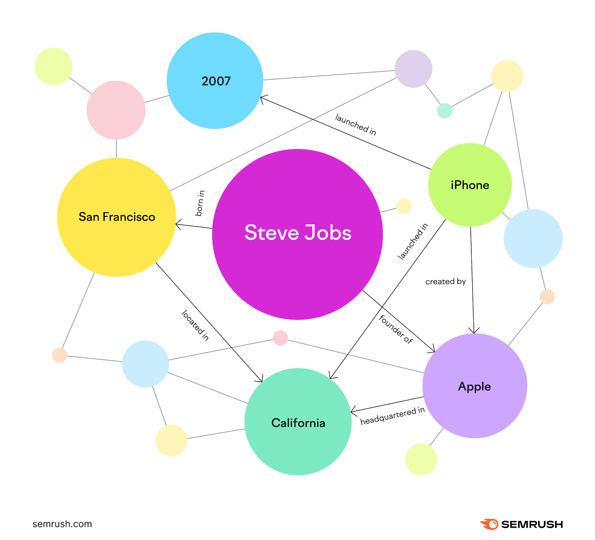

# Knowledge Graph Pipeline

A powerful, configurable pipeline for automatically extracting entities and relationships from documents and building knowledge graphs. This tool processes various document formats (PDF, DOCX, TXT, Markdown) and creates structured knowledge representations that can be imported into Neo4j graph databases.



## 🌟 Features

- **Multi-format Document Processing**: Supports PDF, DOCX, TXT, and Markdown files
- **Intelligent Entity Extraction**: Uses advanced LLMs (OpenAI GPT or Anthropic Claude) to identify entities and relationships
- **Configurable Entity Types**: Customize entity and relationship types for your domain
- **Caching System**: Intelligent caching to avoid reprocessing unchanged files
- **Parallel Processing**: Multi-threaded processing for faster execution
- **Neo4j Integration**: Direct import to Neo4j graph database
- **Embedding Support**: Optional text embeddings for semantic search
- **Progress Tracking**: Detailed logging and progress bars
- **Resumable Processing**: State management for interrupted runs

## 🏗️ Architecture

The pipeline follows this workflow:

1. **Document Discovery**: Scans input directory for supported file formats
2. **Text Extraction**: Extracts text from various document formats
3. **Text Chunking**: Splits large documents into manageable chunks
4. **Entity Extraction**: Uses LLMs to identify entities and relationships from each chunk
5. **Data Merging**: Combines and deduplicates entities across all documents
6. **Cypher Generation**: Creates Neo4j Cypher queries for graph import
7. **Neo4j Import**: Optionally imports the knowledge graph into Neo4j

## 🚀 Quick Start

### Prerequisites

- Python 3.8 or higher
- Neo4j database (optional, for graph visualization)
- OpenAI API key or Anthropic API key

### Installation

1. **Clone the repository**:

```bash
git clone https://github.com/fabischkamau/Knowledge-Graphs-Unstructured.git
cd knowledge-graph-unstructured
```

2. **Create a virtual environment**:

```bash
python -m venv venv
source venv/bin/activate  # On Windows: venv\Scripts\activate
```

3. **Install dependencies**:

```bash
pip install -r requirements.txt
```

4. **Set up environment variables**:
   Create a `.env` file in the project root:

```env
# OpenAI Configuration (if using OpenAI)
OPENAI_API_KEY=your_openai_api_key_here

# Anthropic Configuration (if using Claude)
ANTHROPIC_API_KEY=your_anthropic_api_key_here

# Neo4j Configuration (optional)
NEO4J_PASSWORD=your_neo4j_password
```

5. **Configure the pipeline**:
   Edit `config.yaml` to match your needs (see Configuration section below).

6. **Create input directory and add documents**:

```bash
mkdir input
# Copy your documents (PDF, DOCX, TXT, MD files) to the input folder
```

7. **Run the pipeline**:

```bash
python knowledge_graph_pipeline.py
```

## 📁 Project Structure

```
knowledge-graph-pipeline/
├── knowledge_graph_pipeline.py  # Main pipeline script
├── config.yaml                  # Configuration file
├── requirements.txt             # Python dependencies
├── .env                        # Environment variables (create this)
├── input/                      # Place your documents here
├── output/                     # Generated Cypher files
├── cache/                      # Cached extraction results
├── logs/                       # Log files
└── README.md                   # This file
```

## ⚙️ Configuration

The `config.yaml` file controls all aspects of the pipeline. Key sections include:

### LLM Configuration

```yaml
llm:
  provider: "openai" # "openai" or "anthropic"
  model: "gpt-4o-mini" # Model name
  api_key: "${OPENAI_API_KEY}" # API key from environment
  temperature: 0 # Randomness (0 = deterministic)
```

### Document Processing

```yaml
supported_formats:
  - "txt"
  - "pdf"
  - "docx"
  - "md"

chunk_size: 1500 # Characters per chunk
chunk_overlap: 500 # Overlap between chunks
max_workers: 2 # Parallel processing threads
```

### Entity Types

Customize the types of entities to extract:

```yaml
allowed_entity_types:
  - "Person"
  - "Organization"
  - "Location"
  - "Event"
  - "Concept"
  - "Document"
  - "Technology"
  - "Product"
  - "Topic"
```

### Relationship Types

Define the relationships between entities:

```yaml
allowed_relationship_types:
  - "MENTIONS"
  - "RELATED_TO"
  - "WORKS_FOR"
  - "BELONGS_TO"
  - "COLLABORATES_WITH"
  # ... add more as needed
```

### Neo4j Integration

```yaml
neo4j:
  uri: "bolt://localhost:7687"
  username: "neo4j"
  password: "${NEO4J_PASSWORD}"

auto_import_neo4j: true # Automatically import to Neo4j
```

## 🔧 Usage

### Basic Usage

```bash
# Process all documents in input directory
python knowledge_graph_pipeline.py

# Use custom config file
python knowledge_graph_pipeline.py --config my_config.yaml

# Use custom environment file
python knowledge_graph_pipeline.py --env my_vars.env
```

### Advanced Usage

```bash
# Show pipeline statistics
python knowledge_graph_pipeline.py --stats

# Generate Cypher from cached data only (no new processing)
python knowledge_graph_pipeline.py --generate-cypher

# Force import to Neo4j
python knowledge_graph_pipeline.py --import-neo4j
```

### Pipeline Output

The pipeline generates several outputs:

1. **Cypher Files**: `output/knowledge_graph_YYYYMMDD_HHMMSS.cypher`
   - Contains Neo4j Cypher queries to recreate the knowledge graph
2. **Cache Files**: `cache/*.json`
   - Cached extraction results for each processed document
3. **State File**: `pipeline_state.pkl`
   - Tracks processing state for resumable runs
4. **Log Files**: `logs/kg_pipeline_YYYYMMDD_HHMMSS.log`
   - Detailed execution logs

## 🗄️ Neo4j Integration

### Setting up Neo4j

1. **Install Neo4j Desktop** or use **Neo4j Community Edition**
2. **Create a new database** or use an existing one
3. **Update credentials** in your `.env` file
4. **Configure connection** in `config.yaml`

### Using the Generated Knowledge Graph

Once imported to Neo4j, you can query your knowledge graph:

```cypher
// Find all people and their organizations
MATCH (p:Person)-[:WORKS_FOR]->(o:Organization)
RETURN p.name, o.name

// Find all documents mentioning a specific concept
MATCH (d:Document)-[:MENTIONS]->(c:Concept {name: "artificial intelligence"})
RETURN d.name

// Find connection paths between entities
MATCH path = (a:Person {name: "John Doe"})-[*1..3]-(b:Organization)
RETURN path
```

### Graph Visualization

Use Neo4j Browser or Neo4j Bloom to visualize your knowledge graph:

- Navigate to `http://localhost:7474` (Neo4j Browser)
- Use Cypher queries to explore relationships
- Create custom visualizations based on your entity types

## 🛠️ Customization

### Domain-Specific Configuration

For specialized domains, customize the extraction context:

```yaml
extraction_context:
  domain: "medical" # Your domain
  focus_areas:
    - "clinical trials"
    - "drug interactions"
    - "patient outcomes"
```

### Adding New Entity Types

1. Add new types to `allowed_entity_types` in config.yaml
2. Update the extraction prompt if needed
3. Restart the pipeline

### Custom Document Processors

Extend the `DocumentProcessor` class to support additional file formats:

```python
@staticmethod
def extract_text_from_custom(file_path: Path) -> str:
    # Your custom extraction logic
    pass
```

## 🔍 Troubleshooting

### Common Issues

**"No module named 'fitz'"**

```bash
pip install pymupdf
```

**"DOCX processing disabled"**

```bash
pip install python-docx
```

**Neo4j connection failed**

- Check if Neo4j is running
- Verify credentials in `.env` file
- Check the URI format (usually `bolt://localhost:7687`)

**Out of memory errors**

- Reduce `chunk_size` in config.yaml
- Reduce `max_workers` for parallel processing
- Process fewer files at once

### Performance Optimization

- **Increase `max_workers`** for faster parallel processing (if you have sufficient CPU cores)
- **Enable caching** to avoid reprocessing unchanged files
- **Use smaller chunks** for memory-constrained environments
- **Disable embeddings** if not needed to save processing time

### Debugging

Enable debug logging in `config.yaml`:

```yaml
log_level: "DEBUG"
log_to_file: true
```

Check log files in the `logs/` directory for detailed execution information.

## 📊 Monitoring and Statistics

View pipeline statistics:

```bash
python knowledge_graph_pipeline.py --stats
```

This shows:

- Number of processed files
- Total entities and relationships extracted
- Processing time and performance metrics
- Cache hit rates

## 🔄 Incremental Processing

The pipeline supports incremental processing:

- **State management**: Tracks processed files to avoid duplication
- **File change detection**: Only processes modified files
- **Resumable runs**: Continue interrupted processing sessions
- **Cache optimization**: Reuses previous extraction results

## 🤝 Contributing

1. Fork the repository
2. Create a feature branch (`git checkout -b feature/amazing-feature`)
3. Commit your changes (`git commit -m 'Add amazing feature'`)
4. Push to the branch (`git push origin feature/amazing-feature`)
5. Open a Pull Request

## 📄 License

This project is licensed under the MIT License - see the LICENSE file for details.

## 🆘 Support

For issues and questions:

1. Check the troubleshooting section above
2. Review the logs in the `logs/` directory
3. Create an issue in the repository with:
   - Your configuration file (remove sensitive data)
   - Error logs
   - Steps to reproduce the issue

## 🎯 Roadmap

- [ ] Support for additional document formats (PPTX, HTML, RTF)
- [ ] Web interface for configuration and monitoring
- [ ] Integration with other graph databases (Amazon Neptune, ArangoDB)
- [ ] Real-time document processing with file watchers
- [ ] Advanced entity resolution and deduplication
- [ ] Support for multilingual documents
- [ ] Integration with vector databases for hybrid search
